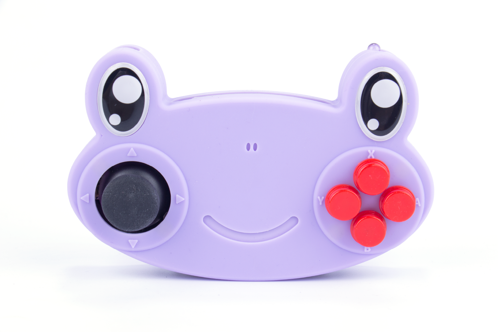
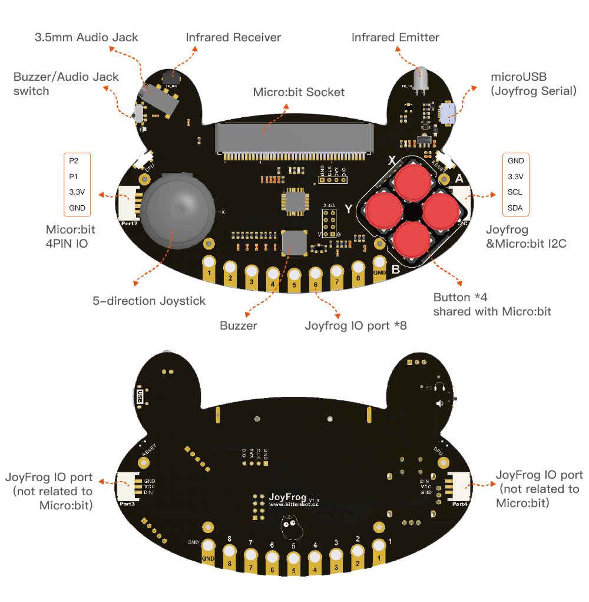

# JoyFrog

Joyfrog is a piece of cute programming hardware that looks like a frog. It is covered by an environmentally friendly silicone case which makes it comfortable to grip and hold. It can be used as a remote control in combination with micro:bit.
We designed it this way in order to attract children's attention with the cute look, so that they can have fun and learn knowledge of programming at the same time.



## Feature

* This extension is designed to programme and drive the JoyFrog for micro:bit, You can [get Joyfrog From KittenBot](https://item.taobao.com/item.htm?spm=a1z10.3-c-s.w4002-21482550023.32.42a95d5fcvWbCF&id=592303306447)



  

----------
## Basic usage

* Simple control of JoyFrog

```blocks
    joyfrog.on_btn_pressed(joyfrog.JoyBtns.BTN_UP, function () {
        basic.showArrow(ArrowNames.North)
    })
    joyfrog.on_btn_pressed(joyfrog.JoyBtns.BTN_RIGHT, function () {
        basic.showArrow(ArrowNames.East)
    })
    joyfrog.on_btn_pressed(joyfrog.JoyBtns.BTN_LEFT, function () {
        basic.showArrow(ArrowNames.West)
    })
    joyfrog.on_btn_pressed(joyfrog.JoyBtns.BTN_SPACE, function () {
        basic.showIcon(IconNames.Heart)
    })
    joyfrog.on_btn_pressed(joyfrog.JoyBtns.BTN_DOWN, function () {
        basic.showArrow(ArrowNames.South)
    })
    joyfrog.joyfrog_init()

```

---

* Infrared remote control signal sending and receiving

```blocks
    joyfrog.on_infra_data(function (data) {
        ir = data
        basic.showString(ir)
    })
    joyfrog.on_btn_pressed(joyfrog.JoyBtns.BTN_A, function () {
        joyfrog.infra_send(ir)
    })
    let ir = ""
    joyfrog.joyfrog_init()

```

---

* IO Port control

```blocks
    joyfrog.on_btn_pressed(joyfrog.JoyBtns.BTN_X, function () {
        joyfrog.digi_write(joyfrog.JoyPort.PORT_3, 0)
    })
    joyfrog.on_btn_pressed(joyfrog.JoyBtns.BTN_Y, function () {
        joyfrog.digi_write(joyfrog.JoyPort.PORT_3, 1)
    })
    joyfrog.joyfrog_init()

```

---

## License

MIT

## Supported targets

* for PXT/microbit
(The metadata above is needed for package search.)

```package
github:Kittenbot/pxt-joyfrog
```
